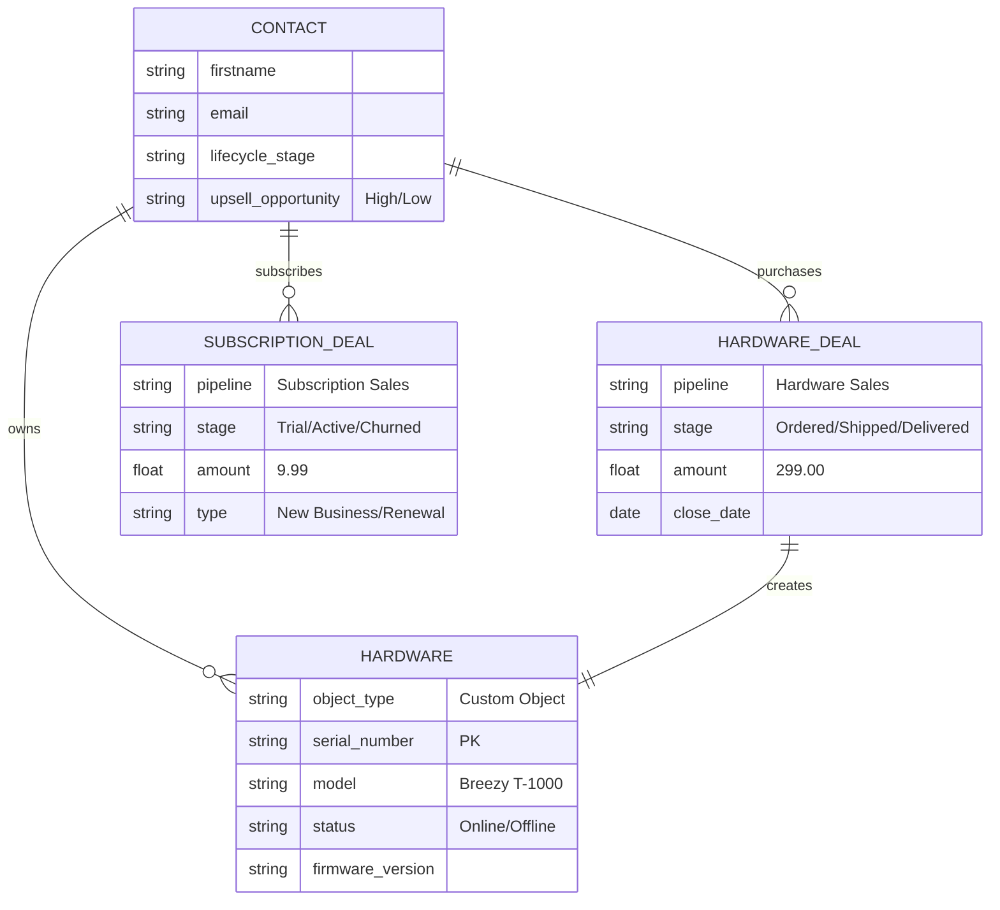

# HubSpot Integration Backend – Breezy Technical Assessment

---

## A. Setup Instructions

### How to run your application locally

```bash
git clone https://github.com/YOUR_USER/hs-solution-architect-tech-assignment.git
cd hs-solution-architect-tech-assignment
npm install

# Start the app
npm run dev
```

Open the UI:

http://localhost:3001/index.html

---

Dependencies and prerequisites  
Node.js v14+

HubSpot Enterprise Account or Free Developer Test Portal

HubSpot Private App with these scopes:

crm.objects.contacts.read  
crm.objects.contacts.write  
crm.objects.deals.read  
crm.objects.deals.write  
crm.objects.custom.read  
crm.objects.custom.write  

Google Gemini API Key (Free Tier)

---

Expected environment variables  
Create a .env file in the project root:

```env
HUBSPOT_ACCESS_TOKEN=pat-na1-your-token
GEMINI_API_KEY=AIza-your-google-key
```

---

### HubSpot Portal Configuration  
Before running the app, set up your HubSpot portal to match the backend logic.

#### Create Custom Object: Hardware  
Name: Hardware  
Required Property: model (single-line text)  
Update Custom Object ID in server.js with your custom object’s ID (example: 2-12345).  
Update the association ID to match your Custom Object → Contact associationID.

#### Create Deal Pipelines

**Hardware Sales Pipeline**  
Stages:
- Purchase Completed  
- Shipped  
- Delivered  

**Subscription Sales Pipeline**  
Stages:
- Trial Started  
- Active  
- Churned  

Update the Pipeline IDs and Stage IDs in server.js.

#### Create Contact Properties  
upsell_opportunity: single-line text  
Used by the AI feature to flag high-value leads.

---

### How to test the integration flow  
After setup and starting the app:

#### Test contact sync  
Use the UI to create a new customer in HubSpot.  
View existing synced contacts in the UI.

#### Test hardware + subscription deals  
From the UI, create a Hardware Bundle or Subscription Deal.

Confirm:
- A Hardware Deal or Subscription Deal is created in HubSpot.
- A Hardware custom object record is created and associated with the contact when a bundle is purchased.
- The correct pipeline and stages are used for each type of deal selected.

#### Test AI upsell flow  
Use the “✨ Scan for Upsell” button in the UI.

Confirm:
- The mock telemetry data is processed and categorizes a contact as “High priority” or “Low priority” in UI.
- The AI logic updates the upsell_opportunity contact property to “High” in HubSpot (Low is ignored).

---

## B. Project Overview  
### Brief explanation of what your POC demonstrates

This Proof of Concept (POC) shows a synchronization engine between Breezy’s platform and HubSpot. It simulates an admin panel where users can:

- Sync customer data: Create new contacts in HubSpot from Breezy and view synced contacts.  
- Create hardware bundles: Automatically create a Subscription Deal or Hardware Deal + Free Trial. A Hardware custom object record is created and linked to the contact when a bundle is purchased.  
- Use AI for upsell: Use Generative AI to find upsell opportunities based on thermostat telemetry (energy usage) data.

---

## C. AI Usage Documentation  

### Which AI tools did you use?
- Replit  
- Gemini  
- Breeze Data Model  
- HubSpot AI Assistant  

### What tasks did you use AI for?
- Used Replit to generate a first draft of the UI.  
- Uploaded that draft to Gemini to get a cleaner version with only HTML, CSS, and JavaScript.  
- Used Gemini for step-by-step help after importing files.  
- Consulted Gemini for various approaches to structure the data model, then compared those ideas with Breeze data model recommendations and applied them to the demo portal (with a few manual changes).  
- Used HubSpot’s AI Assistant to fetch internal values needed in the code:
  - Custom object ID  
  - Association ID  
  - Pipeline IDs  
  - Deal Stage IDs  
- Passed those values back to Gemini to update the endpoints for:
  - Multiple pipelines  
  - Custom object creation and association  
- Used Gemini to help build the AI Upsell Detector and wire it into app.js and server.js.

### What did you learn? What was challenging?

**Learned:**  
- How to use AI endpoints.  
- How to work with AI to customize and refine prototypes.  
- How to apply Breeze data model recommendations in a demo.
- How to create a project on Github

**Challenging:**  
- Getting some parts of the code to work (a lot of trial and error).  
- Being blocked by the Associations API v3, then switching to v4 based on Gemini’s suggestion.  
- Testing several Gemini models until gemini-2.0-flash-exp “worked”.  
- Adjusting expectations around automatic insight updates.

### How did AI help (or not help)?
- AI helped write UI code, data model code, and backend endpoints.  
- AI helped resolve API version issues.  
- AI did not automatically request internal IDs needed to complete the POC.  
- AI generated parts of the README, but manual corrections were required.

---

## D. HubSpot Data Architecture  

This design supports Breezy’s hybrid business model by separating:

- **Assets (Hardware Inventory)** – custom object  
- **Revenue (Subscriptions and Deals)** – separate pipelines  

---

### 1. Entity Relationship Diagram (ERD)



---

### 2. Deal Pipeline Architecture

**Hardware Sales Pipeline**  
Stages: Purchase Completed → Shipped → Delivered  
Tracks one-time hardware purchases.

**Subscription Sales Pipeline**  
Stages: Trial Started → Active → Churned  
Tracks recurring subscription revenue.

These are set in HubSpot and referenced in server.js.

---

## E. Optional: AI Feature Explanation  

### Describe your AI-powered feature  
The **Intelligent Upsell Detector**:

- Mocks monthly energy spend  
- Uses Google Gemini to compare spend vs subscription cost  
- Updates upsell_opportunity to “High” when ROI is positive  
- For the demo, the logic is randomized  
- Triggered manually via “✨ Scan for Upsell”  

### Why did you choose this feature?
- Connects device telemetry with CRM  
- Shows real revenue opportunities  
- Fits Breezy’s hardware + subscription model  

### How does it make the integration smarter?
- Identifies strong upsell candidates  
- Helps Sales focus efforts  
- Helps Marketing build precise Active Lists  

### When use AI vs rules?
Use AI for multi-input predictions.  
Use rules for simple thresholds.

---

## F. Design Decisions  

### Technical choices you made and why

**Hardware as a Custom Object**  
- Allows multi-device ownership  
- Enables identifying customers with multiple thermostats

**Dual Deal Pipelines**  
- Separates revenue types  
- Improves visibility into trials and churn  
- Supports win-back campaigns

**Manual AI Trigger**  
- Keeps POC simple  
- Avoids Gemini rate limits  

---

### Assumptions  
- Breezy provides telemetry data  
- Customers may own multiple thermostats  

---

### What you'd improve with more time  
- Use Search API for contact lists  
- Replace random AI logic  
- Automate AI scan  
- Improve UI detail and visibility  

---

### What you'd ask before production  
- Define “High Opportunity” contact  
- Understand target segments  
- Confirm privacy/compliance constraints  
- Identify other required integrations  
