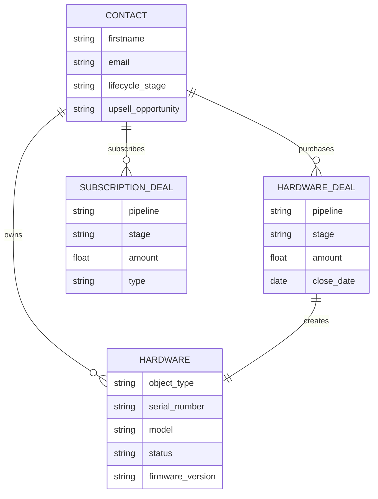

# HubSpot Integration Backend – Breezy Technical Assessment

---

## A. Setup Instructions

### How to run your application locally

```bash
git clone https://github.com/mckenningHS/SAproject.git
cd SAproject
npm install

# Start the app
npm run dev
```

Open the UI:

http://localhost:3001/index.html

---

Dependencies and prerequisites  
Node.js v14+

HubSpot Enterprise Account or Free Developer Test Portal

HubSpot Private App with these scopes:

crm.objects.contacts.read  
crm.objects.contacts.write  
crm.objects.deals.read  
crm.objects.deals.write  
crm.objects.custom.read  
crm.objects.custom.write  

Google Gemini API Key (Free Tier)

---

Expected environment variables  
Create a .env file in the project root:

```env
HUBSPOT_ACCESS_TOKEN=pat-na1-your-token
GEMINI_API_KEY=AIza-your-google-key
```

---

### HubSpot Portal Configuration  
Before running the app, set up your HubSpot portal to match the backend logic.

To Create assets listed below, you can use the following prompt on HubSpot's AI assistant:

```env
Create the following assets: 

Custom Object: Create an object called 'Hardware' (Plural: 'Hardware'). It must have a primary display property called 'model' (Single-line text) and a property for 'serial_number'. It needs a Many-to-One association with Contacts.

Deal Pipelines:

Create a 'Hardware Sales' pipeline with stages: 'Website Visit', 'Added To Cart', 'Purchase Completed', 'Order Shipped', 'Order Delivered'.

Create a 'Subscription Sales' pipeline with stages: 'Free Trial Started', 'Engaged With Features', 'Trial Ending Soon', 'Subscription Purchased', 'Subscription Cancelled'.

Contact Properties: Create a custom property group 'Breezy Intelligence' and add a property 'upsell_opportunity' (Single-line text).
```


To get internal values, *start a new chat* with AI assistant and request:

```env 
provide me the internal values for each of the stages of the subscription sales pipeline and hardware sales pipeline, along with label.

Also, provide me with the internal ID of Hardware object, and association ID for Contact->Hardware association
```

Then, Use Gemini to update server.js:

```env 
"I have a Node.js file (server.js) that connects to the HubSpot API. I need to update the configuration constants with new Internal IDs from my portal.

Here is my current server.js code: [PASTE YOUR SERVER.JS CONTENT HERE]

Please refactor the PIPELINES and CUSTOM_OBJECTS constants at the top of the file with these specific new values:

Hardware Object ID: [PASTE NEW ID]

Hardware Pipeline ID: [PASTE NEW ID] (Stage 'Purchase Completed': [PASTE ID])

Subscription Pipeline ID: [PASTE NEW ID] (Stages 'Trial': [PASTE ID], 'Active': [PASTE ID])

Association ID (Contact->Hardware): [PASTE ID]

Return only the updated const PIPELINES = ... and const CUSTOM_OBJECTS = ... code blocks so I can copy-paste them back."
```

#### Create Custom Object: Hardware  
Name: Hardware  
Required Property: model (single-line text)  
Update Custom Object ID in server.js with your custom object’s ID (example: 2-12345).  
Update the association ID to match your Custom Object → Contact associationID.

#### Create Deal Pipelines

**Hardware Sales Pipeline**  
Stages:
- Website Visit
- Added To Cart
- Purchase Completed
- Order Shipped
- Order Delivered

**Subscription Sales Pipeline**  
Stages:
- Free Trial Started
- Engaged With Features
- Trial Ending Soon
- Subscription Purchased
- Subscription Cancelled

Update the Pipeline IDs and Stage IDs in server.js.

#### Create Contact Properties  
upsell_opportunity: single-line text  
Used by the AI feature to flag high-value leads.

---

### How to test the integration flow  
After setup and starting the app:

#### Test contact sync  
Use the UI to create a new customer in HubSpot.  
View existing synced contacts in the UI.

#### Test hardware + subscription deals  
From the UI, create a Hardware Bundle or Subscription Deal.

Confirm:
- A Hardware Deal or Subscription Deal is created in HubSpot.
- A Hardware custom object record is created and associated with the contact when a bundle is purchased.
- The correct pipeline and stages are used for each type of deal selected.

#### Test AI upsell flow  
Use the “✨ Scan for Upsell” button in the UI.

Confirm:
- The mock telemetry data is processed and categorizes a contact as “High priority” or “Low priority” in UI.
- The AI logic updates the upsell_opportunity contact property to “High” in HubSpot (Low is ignored).

---

## B. Project Overview  
### Brief explanation of what your POC demonstrates

This Proof of Concept (POC) shows a synchronization engine between Breezy’s platform and HubSpot. It simulates an admin panel where users can:

- Sync customer data: Create new contacts in HubSpot from Breezy and view synced contacts.  
- Create hardware bundles: Automatically create a Subscription Deal or Hardware Deal + Free Trial. A Hardware custom object record is created and linked to the contact when a bundle is purchased.  
- Use AI for upsell: Use Generative AI to find upsell opportunities based on thermostat telemetry (energy usage) data.

---

## C. AI Usage Documentation  

### Which AI tools did you use?
- Replit  
- Gemini  
- Breeze Data Model  
- HubSpot AI Assistant  

### What tasks did you use AI for?
- Used Replit to generate a first draft of the UI.  
- Uploaded that draft to Gemini to get a cleaner version with only HTML, CSS, and JavaScript.  
- Used Gemini for step-by-step help after importing files.  
- Consulted Gemini for various approaches to structure the data model, then compared those ideas with Breeze data model recommendations and applied them to the demo portal (with a few manual changes).  
- Used HubSpot’s AI Assistant to fetch internal values needed in the code:
  - Custom object ID  
  - Association ID  
  - Pipeline IDs  
  - Deal Stage IDs  
- Passed those values back to Gemini to update the endpoints for:
  - Multiple pipelines  
  - Custom object creation and association  
- Used Gemini to help build the AI Upsell Detector and wire it into app.js and server.js.

### What did you learn? What was challenging?

**Learned:**  
- How to use AI endpoints. 
- How to work with AI to customize and refine prototypes.  
- How to apply Breeze data model recommendations in a demo.
- How to create a project on Github
- Learned how to create and use ERD diagrams for representing object relationships.

**Challenging:**  
- Getting some parts of the code to work (a lot of trial and error).  
- Being stuck when using Associations API v3, then switching to v4 based on Gemini’s suggestion.  
- Testing several Gemini models until gemini-2.0-flash-exp “worked”.  
- Adjusting expectations around automatic insight updates.

### How did AI help (or not help)?
- AI helped write frontend code, data model code, and backend code.  
- AI helped resolve Gemini API version issues.  
- AI supported my decision-making by evaluating my architecture plan for this business context and offering constructive feedback.
- AI did not automatically request internal IDs needed to complete the POC.  
- AI generated portions of the README, although several manual corrections were required.
---

## D. HubSpot Data Architecture  

This design supports Breezy’s hybrid business model by separating:

- **Assets (Hardware Inventory)** – custom object  
- **Revenue (Subscriptions and Deals)** – separate pipelines  

---

1. Entity Relationship Diagram (ERD)



2. Deal Pipeline Architecture

- Hardware Sales Pipeline

  - Stages: Website Visit → Added To Cart → Purchase Completed → Order Shipped → Order Delivered
  - Tracks one-time hardware purchases (e.g., $299).

- Subscription Sales Pipeline

  - Stages:Free Trial Started → Engaged With Features → Trial Ending Soon → Subscription Purchased → Subscription Cancelled
  - Tracks recurring subscription revenue (e.g., $9.99/month).

These are set in HubSpot and referenced in server.js.

---

## E. Optional: AI Feature Explanation  

### Describe your AI-powered feature  
The **Intelligent Upsell Detector**:

- It mocks monthly energy spend for a thermostat.
- It uses Google Gemini to compare this spend to the cost of the premium subscription.
- If the ROI is positive, it updates the HubSpot Contact property upsell_opportunity to “High”.
- For this POC, the logic on the server is a mock: it randomly marks contacts as “High” or “Low” for demo purposes.
-  The AI scan is triggered by a manual “✨ Scan for Upsell” button to stay within Gemini free-tier rate limits. In a production setup, this scan would be automated.”  

### Why did you choose this feature?

This feature connects Breezy’s device and commerce data with HubSpot’s CRM by turning estimated energy usage into actionable upsell signals. It ties Breezy’s hardware + subscription model directly into revenue-focused insights that sales and marketing teams can use.
A key benefit is that Breezy doesn’t need to send all of its e-commerce or device-level data into HubSpot. The evaluation happens inside Breezy’s own platform, and only the meaningful outcome (e.g., upsell_opportunity = High) is pushed to the CRM. This keeps HubSpot clean, protects sensitive business data, and surfaces only the insights that matter.

### How does it make the integration smarter?

- It highlights which customers are likely good upsell candidates, not just who owns a device.
- Sales can focus on High Opportunity contacts instead of a generic list.
- Marketing can build Active Lists based on the upsell_opportunity property and target “High” contacts with stronger offers.

### When use AI vs rules?

- Use AI when evaluating many inputs (telemetry, house size, device model, season, etc.) to make a flexible prediction of upsell potential, not just a simple threshold.
- Use traditional logic when a basic rule is enough (for example, energy spend > X for 3 months in a row).

In this POC, the AI-based feature replaces what would otherwise be a very complex set of nested if/then rules.

---

## F. Design Decisions  

### Technical choices you made and why

**Hardware as a Custom Object**  

- Choice: Use a Hardware custom object instead of storing serial number and model on the Contact.
- Reason: A single customer can own multiple devices (e.g., primary home + vacation home). A custom object supports a clear one-to-many relationship and allows easy reporting on customers with multiple thermostats but no premium subscription.

**Dual Deal Pipelines**  

- Choice: Use separate pipelines: Hardware Sales and Subscription Sales.
- Reason:
  - Clean revenue reporting (one-time vs recurring).
  - Better visibility into free trial and churn.
  - Helps identify customers who still own hardware but have a churned subscription for win-back campaigns.

**Manual AI Trigger**  

- Choice: Trigger the AI scan via a manual button (✨ Scan for Upsell) instead of a background job.
- Reason: Stay within Gemini’s free-tier rate limits and keep the POC simple while still showing the full flow.
---

### Assumptions  

- Breezy can send or derive thermostat usage / energy spend data that can be used as telemetry.
- A single Breezy customer can own multiple thermostats across different locations.

---

### What you'd improve with more time  

- Use the Search API to display synced contacts in order of creation date, with pagination.
- Replace the mock random AI logic with a real Gemini-based calculation that uses more telemetry fields.
- Move from a manual AI scan to an automated scan.
- Improve the UI with clearer and more detailed views of deals and hardware assets.

---

### What you'd ask before production  

- What exact business rules should define a “High Opportunity” contact (for AI training and validation)?
- How do Sales and Marketing teams want to segment customers (examples of target lists and campaigns)?
- Are there any rate limit, privacy, or compliance constraints around using telemetry data for marketing and sales?
- Are there other important systems they are currently using that need to connect with HubSpot? 
